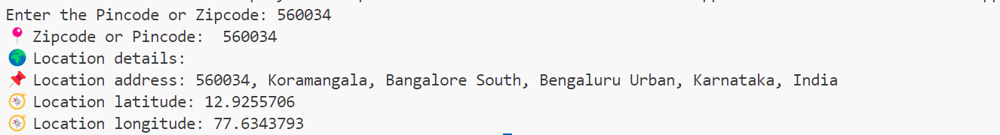

# 📍 Pincode / Zipcode Location Finder 🌍 | Python 🐍
"This Python script utilizes the Geopy library and Nominatim (from OpenStreetMap) to retrieve location information—such as address, latitude, and longitude—by taking a user-provided Pincode or Zipcode as input."

🚀 Features
====================================
✅ Accepts any valid pincode/zipcode

✅ Retrieves the full address

✅ Shows latitude and longitude

✅ Simple and beginner-friendly code

🧱 Requirements 🐍
=======================================
📌 Install the required package:

pip install geopy

💡 Example Output
=======================

